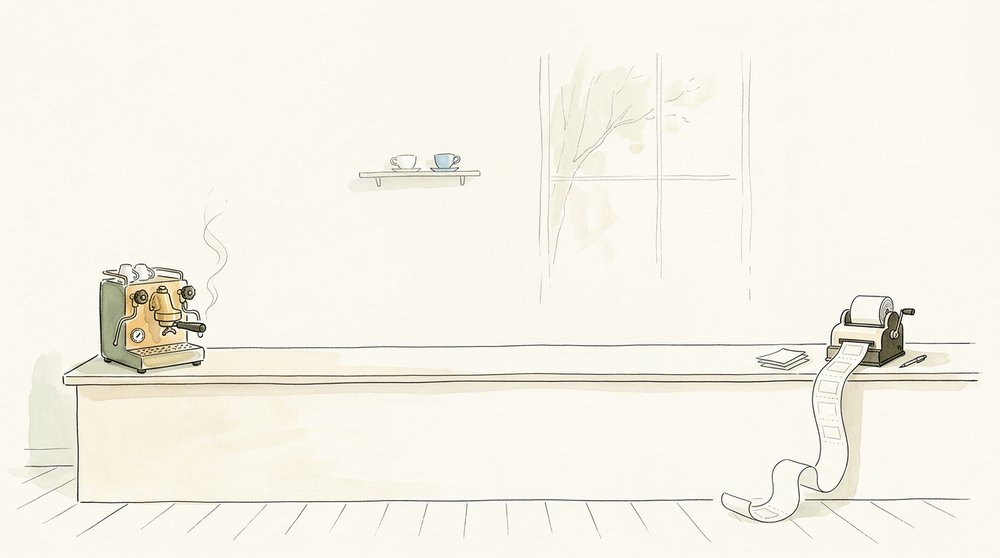

# cursor-cafe-coupons



Generate printable coffee coupons for Cursor community events. Customize the venue, drink menu, and branding — then print or save as HTML/PDF.

Built for [Cursor Ambassadors](https://cursor.com/ambassadors) who partner with local cafes for meetups and need physical drink vouchers.

## Quick Start

```bash
npm install
npm run dev
```

Open [http://localhost:3000](http://localhost:3000) to launch the coupon editor.

## How It Works

1. **Pick a preset** — Classic, Minimal, or Full Menu
2. **Configure** your venue name, logo, event date, and drink menu
3. **Preview** the coupon in real-time
4. **Print** directly or **Save HTML** to print later

Print output is **landscape A4** with a **3-column grid**. Use `"couponsPerPage": "auto"` to pick **9, 6, or 3** coupons per page from menu size (short menus pack more; long menus get fewer, larger cards). Or set `1`–`9` manually.

## CLI

Generate coupons from a JSON config without the web UI:

```bash
# From a config file
npm run cli -- configs/example.json coupons.html

# From a built-in preset
npm run cli -- --preset classic coupons.html

# Single coupon (default is print mode with multiple per page)
npm run cli -- --preset minimal --single coupon.html

# List available presets
npm run cli -- --list-presets
```

## Config Format

Coupon configs are simple JSON. See [`configs/`](./configs) for examples. For agents and LLMs, read [`CUSTOMIZATION.md`](./CUSTOMIZATION.md) and [`configs/schema.json`](./configs/schema.json).

```json
{
  "venue": {
    "name": "Cafe Name",
    "logo": "",
    "logoHeight": 42,
    "wifi": "Free Cafe Wifi"
  },
  "event": {
    "date": "27.03.2026"
  },
  "menu": [
    { "name": "Espresso", "temps": ["hot"] },
    { "name": "Latte", "temps": ["hot", "iced"] },
    { "name": "Cold Brew", "temps": ["iced"] }
  ],
  "options": {
    "beanChoices": ["House Blend", "Decaf"],
    "milkChoices": ["Regular", "Oat"],
    "footerNote": "Valid for 1 complimentary drink",
    "motto": "Happy building!",
    "showCouponNumber": true
  },
  "print": {
    "couponsPerPage": "auto"
  },
  "theme": {
    "headerBg": "#14120b",
    "headerText": "#edecec"
  }
}
```

| Field | Description |
|-------|-------------|
| `venue.name` | Cafe or venue name (shown in header if no logo) |
| `venue.logo` | Logo URL or base64 data URL |
| `venue.logoHeight` | Logo height in pixels (default 42) |
| `venue.wifi` | Wi-Fi network name (optional) |
| `event.date` | Event date in DD.MM.YYYY format |
| `menu` | Array of drinks. Each has a `name` and `temps` (`"hot"`, `"iced"`, or both). Use `"kind": "section"` with `"temps": []` for category headings. |
| `options.beanChoices` | Bean/roast options shown as checkboxes (optional) |
| `options.milkChoices` | Milk alternatives shown as checkboxes (optional) |
| `options.footerNote` | Small print above the branded footer |
| `options.motto` | Tagline on the branded footer bar (Cursor brown). Omit for default `Happy building!`; empty string `""` hides the bar |
| `options.menuTitle` | Custom heading above the drink list (optional) |
| `options.showCouponNumber` | Show an empty "No." box for handwritten numbering |
| `print.couponsPerPage` | `"auto"` (recommended) or integer `1`–`9`. Auto picks 9, 6, or 3 per landscape page from estimated content height |
| `print.orientation` | Deprecated (ignored); print is always landscape |
| `theme.headerBg` | Header band background color |
| `theme.headerText` | Header band text color |

## Project Structure

```
app/
  layout.tsx          Root layout
  page.tsx            Main page — config editor + live preview
  globals.css         Global styles (Cursor theme)

components/
  config-form.tsx     Configuration form (venue, event, menu, options)
  coupon-preview.tsx  Live iframe preview
  menu-editor.tsx     Dynamic drink menu editor
  export-controls.tsx Print / Save HTML / Save Config buttons

lib/
  types.ts            CouponConfig type definition
  generate-html.ts    Core HTML generation engine
  print-layout.ts     Auto grid (9/6/3) + resolve coupons per page
  presets.ts          Built-in presets (Classic, Minimal, Full Menu)

cli/
  generate.ts         CLI entry point
  generate.js         Node wrapper (uses tsx)

configs/
  example.json        Example config
  schema.json         JSON Schema for coupon configs

CUSTOMIZATION.md      Quick reference for humans and LLMs

public/
  cursor-logo.svg     Cursor wordmark (embedded in generated coupons)
  fonts/              CursorGothic font files
```

## Tech Stack

- **Next.js 16** (App Router)
- **React 19**, **TypeScript**
- **Tailwind CSS v4**
- No database — everything runs client-side

Before shipping: `npm run typecheck` and `npm run build` should pass.

## Deployment

Deploy to [Vercel](https://vercel.com) with zero config, or build and serve anywhere:

```bash
npm run build
npm run start
```

## Cursor Ambassador Toolkit

This repo is part of a growing set of open-source tools for Cursor community organizers:

| Tool | Description |
|------|-------------|
| [cursor-ambassador-evergreen](https://github.com/luisfer/cursor-ambassador-evergreen) | Configurable community site template |
| [cursor-ambassador-qr-printer](https://github.com/luisfer/cursor-ambassador-qr-printer) | QR code card generator for referral links |
| [cursor-referral-checker](https://github.com/luisfer/cursor-referral-checker) | Batch-check referral code availability |
| **cursor-cafe-coupons** (this repo) | Printable coffee coupon generator |

## Credits

Built by [Luis Fernando De Pombo](https://github.com/luisfer) as part of the Cursor Ambassador open-source toolkit.

## License

MIT
